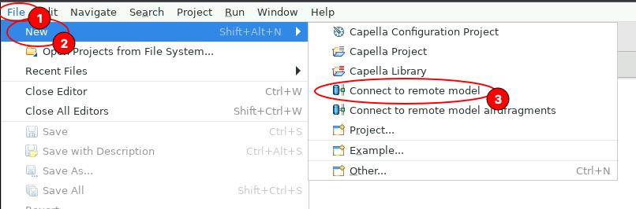
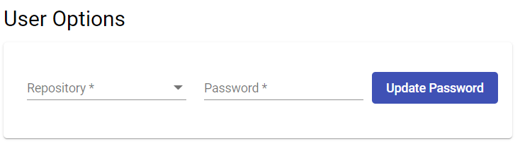
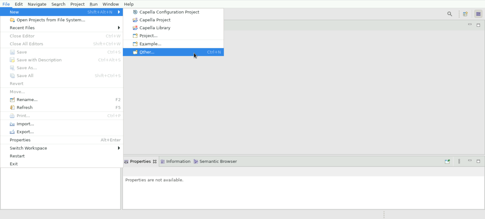
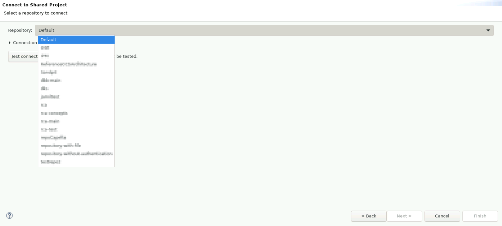

<!--
 ~ SPDX-FileCopyrightText: Copyright DB Netz AG and the capella-collab-manager contributors
 ~ SPDX-License-Identifier: Apache-2.0
 -->

# Getting started with a TeamForCapella-based project

!!! Info
    Please [request a persistent session](../request.md) before you continue with the instructions here.

To get started with a TeamForCapella project you first need read/write access from a Model Manager (usually this role is allocated to lead architects / area owners).

First step is to configure the repository-specific password. This is a TeamForCapella (application) password and it is only valid in scope of one specific project repository. You can set it by navigating to `profile -> settings`.

At the bottom of the Settings page you see `User Options`, followed by a repository selection drop-down, password field, and `Update Password` button. The password will be used later in Capella.

When the repository-specific password is set you can start a `Persistent Workspace Session`. Navigate to `Workspaces`, toggle the session type selector and click `Request Session`.

Session spin-up may take up to 30 seconds. before the connection button will get enabled. Click the `Connect to Session` button when it's enabled. A new browser tab opens and you see Capella loading. First time start may take up to 1 minute.

When Capella is finally loaded you navigate to `File -> New -> Connect to remote model`.

In the drop down select the repository you like to work on. In most cases the repository and project name should match.

Click on `Test connection` and enter the repository-specific credentials you defined in the second step.

The username in the `Test connection` dialog should be already pre-filled, however if this is not the case you may need to fill it in manually.

When the connection test is completed successfully you can click the `Next` button.

Finally a Project selection dialog should appear - the defaults are usually good, just click `Finish`. This should result in a new folder `project-name.team` in your Project Explorer. Open the project, locate a file with a `.aird` extension and double-click it to open the model in read-write mode.

1. You have to set you own password for each TeamForCapella repository you have access to. Please navigate to <a href="/settings" target="_blank">Profile</a>. Here you should see the User settings section, where you can set your password:
    

2. Go back to your session
3. Click on `File` → `New` → `Other`:
    
4. Expand `Team for Capella` and select `Connect to remote model`:
    
5. Select your model from the dropdown list:

    !!! Question "Your model is missing?"
        Please have a look at [Project access](../../projects/access.md)

    
6. Click on `Test connection` and enter your personal credentials.

    !!! Question "What is my username?"
        You can find your username after your session was started.
        Alternatively, you can reopen the dialog when [Reconnecting](../reconnect.md)

    !!! Question "What is my password?"
        Please use the password you did set in step 1.

    !!! Bug
        Do not make use of the `Remember me` functionality. It requires you to enter another master password and is therefore useless.

    

7. Click `Ok` and `Finish`
8. The model should be loaded to your personal workspace.
